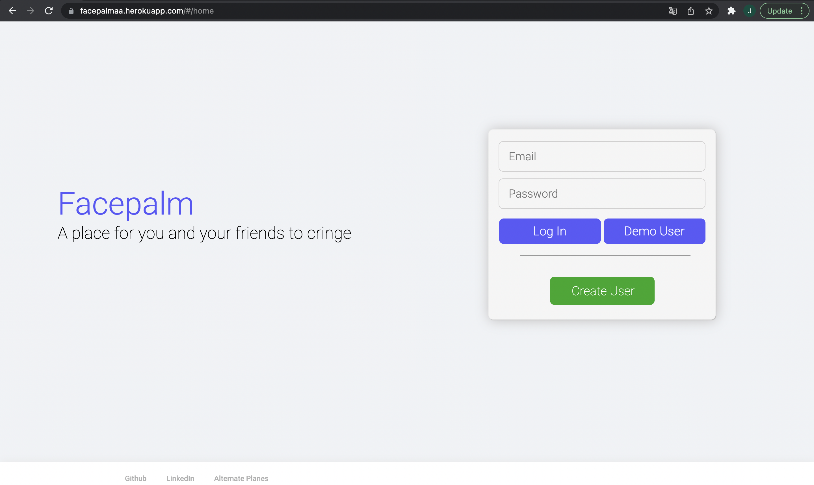
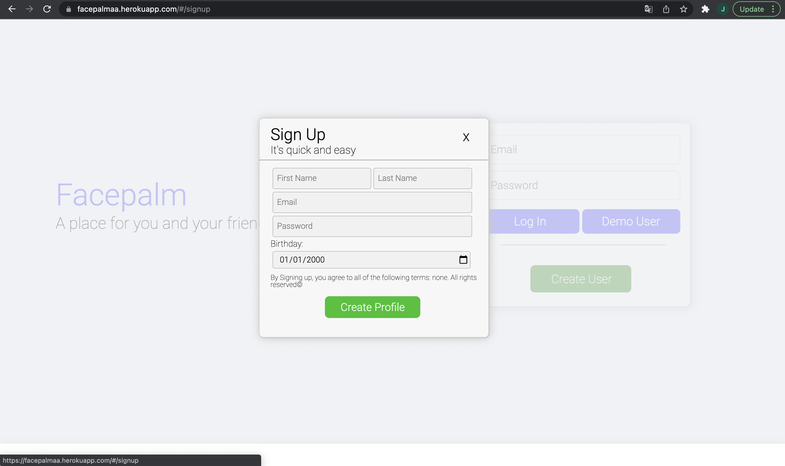
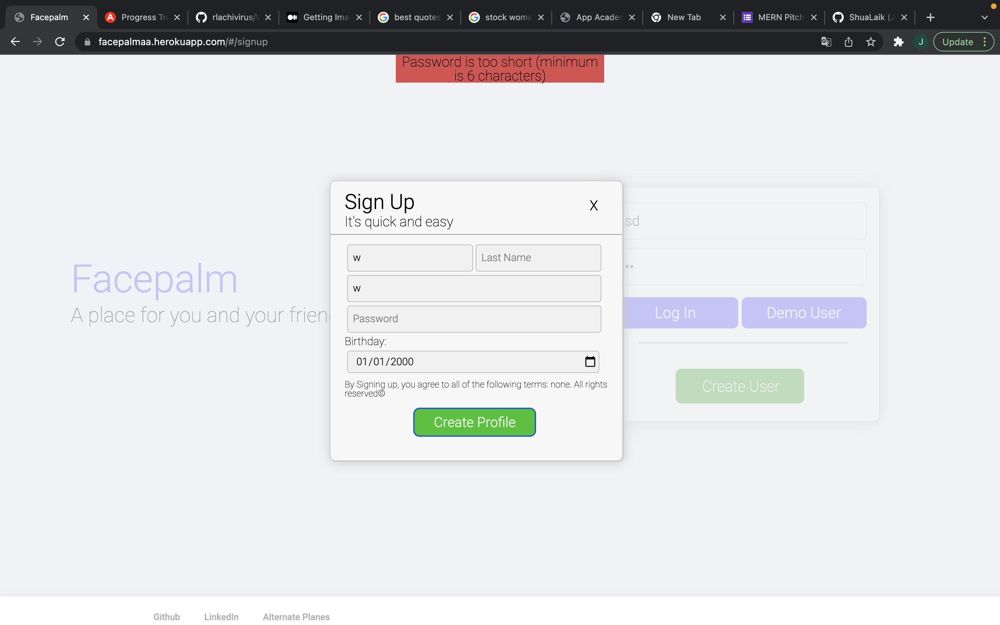

# Facepalm
## Overview
Facepalm is a clone of Facebook where friends can sign up and interact with one another! Much like the original site, Users can sign up and and customize their profile, from their profile photo to their favoritie color! They're also able to make posts, which their fellow acquaintance can comment and interact with. Overall, it's a place to connect and share thoughts.

As you can see, I've switched the 'book' in 'facebook' to 'palm' to represent the more lax side of the social media giant. Facebook has always been a place for people to laugh and enjoy each other's funny content, and even with it recently being extremely politically driven, I wanted to connect with the side that people learned to love once agan.

## Features

### Account Creation and Authentication

Right off the bat, your met with a login page on your first visit, which was stylized as similarly to the facebook login page as possible. A key differnece is that instead of rendering errors to a new page, they are rendered directly to the top of the page, making for a more seamless login/sign up experience. 

The errors are rendered in a function like so: 

`

    {this.renderErrors(this.props.sessionErrors)}

`
            

