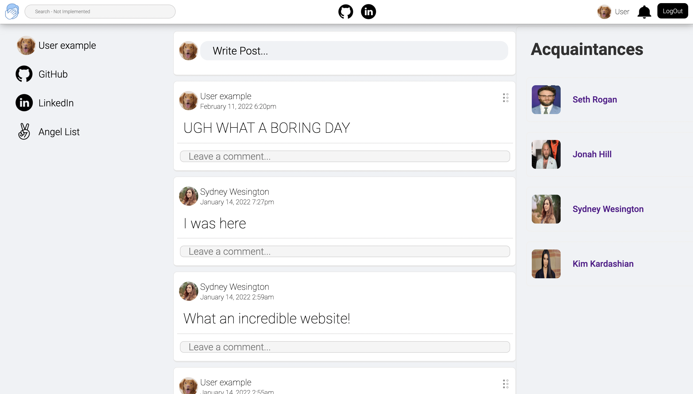
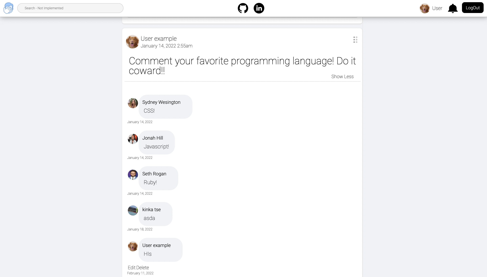
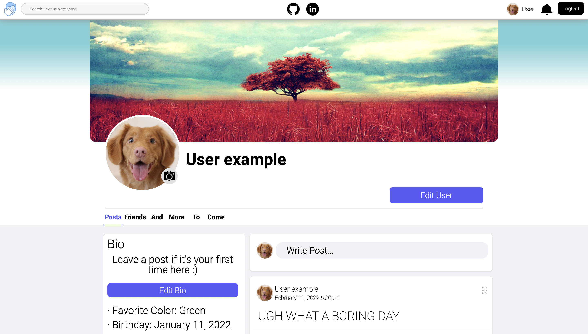
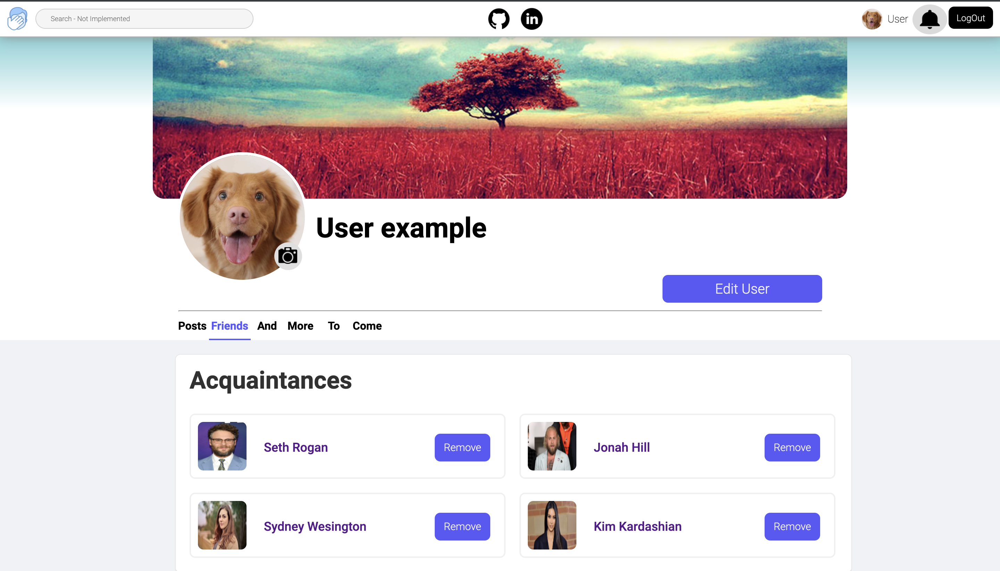
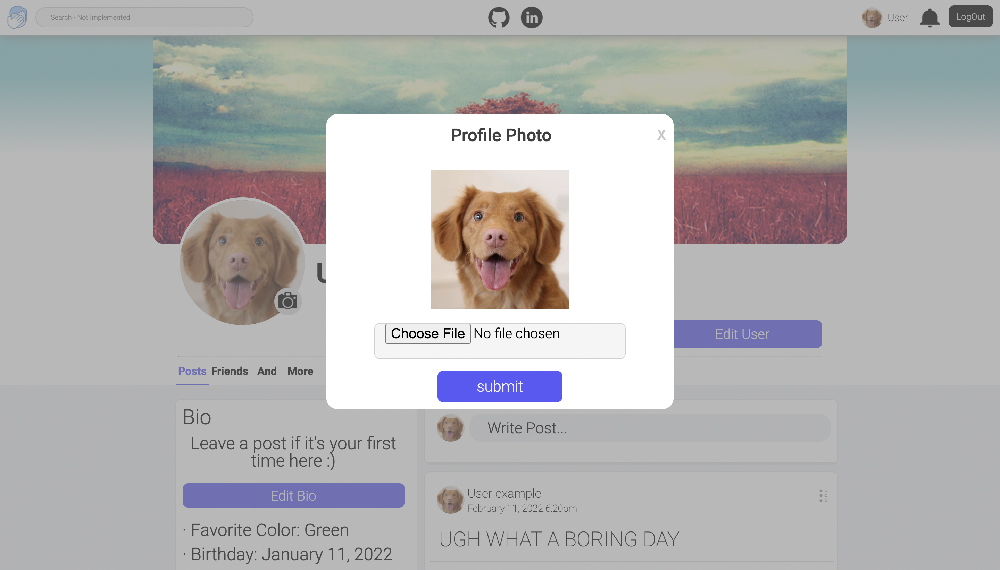
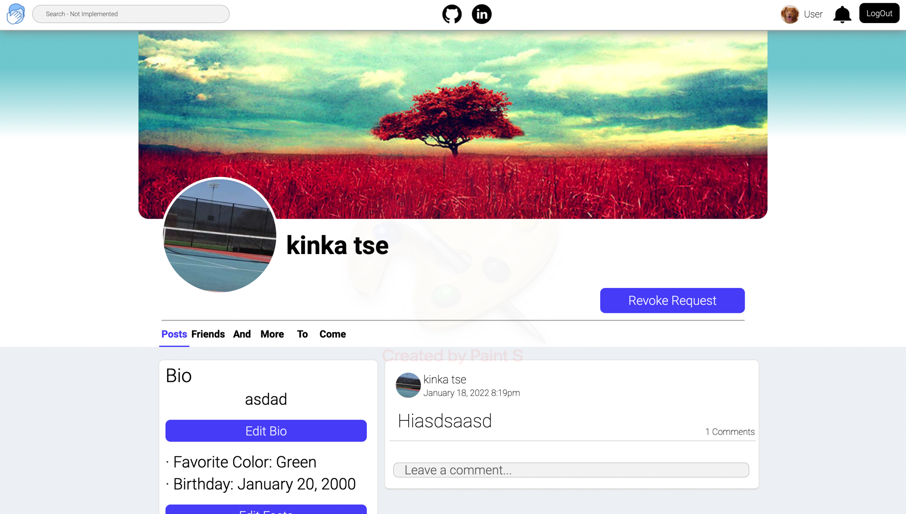

# Facepalm
## Overview
Facepalm is a clone of Facebook where friends can sign up and interact with one another! Much like the original site, Users can sign up and and customize their profile, from their profile photo to their favoritie color! They're also able to make posts, which their fellow acquaintance can comment and interact with. Overall, it's a place to connect and share thoughts.

As you can see, I've switched the 'book' in 'facebook' to 'palm' to represent the more lax side of the social media giant. Facebook has always been a place for people to laugh and enjoy each other's funny content, and even with it recently being extremely politically driven, I wanted to connect with the side that people learned to love once agan.

## Features

Facepalm was created using: 

- Ruby on Rails
- Ruby
- Javascript
- React
- Redux

### Account Creation and Authentication

Right off the bat, your met with a login page on your first visit, which was stylized as similarly to the facebook login page as possible. A key differnece is that instead of rendering errors to a new page, they are rendered directly to the top of the page, making for a more seamless login/sign up experience. 


The errors are rendered in a function like so: 


```
<div className="errors">
    {this.renderErrors(this.props.sessionErrors)}
</div>
```

### Home Page and Creating Posts

After logging in, you'll be met with a very empty looking homepage, and there's only one way to fill it up. Make a post! In your feed, all of your and your acquaintances posts will be shown in posted order. Posts will also have a comment section, so be sure to let you're friends know what their post has you thinking!




### Profile Page

All users will have a profile page where they (and other users) will be able to see that users posts, as well as who the user has Acquainted.




Users will also be able to edit their profile picture, as well as their info (unless demo user, name and email are unchangeable for these accounts)




#### Challenge:

I had a huge issue in the beggining with the page not rendering on first click. This was because the user response was coming in too late, causing the render function to reutrn null.

#### Solution:

To fix this issue, I wound up creating an intermidiary component that loaded the user from the backend BEFORE loading the page.

```
class LoadProfile extends React.Component {

    componentDidMount() {
        if (!this.props.users[this.props.match.params.id]){
            this.props.fetchUser(this.props.match.params.id)
        }
        this.props.fetchPosts(this.props.match.params.id)
        this.props.fetchNotifications()
        this.props.fetchPendingNotifcations()

    }
    componentDidUpdate(prevProps) {
        if (prevProps.match.params.id !== this.props.match.params.id){
            if (!this.props.users[this.props.match.params.id]){
               
                this.props.fetchUser(this.props.match.params.id)
            }
        }
        
    }
    render() {
        ...
    }
}
```

### Adding Acquaintances 

What would a social media website be without adding your closest friends? The answer is Facepalm! Facepalm allows users to add their know-in-passing friends (Acquaintances) simply and easily. By pressing the Acquaintance button on a profile, a request is sent, changing the button below:



From here, a user gets a notification. When pressed, the notification links to the user's page, allowing the user to accept the request and add thier friend!

#### Challenge:

From the very beggining, these buttons proved to be difficult to update on a click. Getting the state to properly update was difficult, as I chose to render the button type in state, which in turn made conditionally rendering in the render function impossible. It also wouldn't update the users 

#### Solution:

I wound up sticking the contitional function inside of `componentDidUpdate`, allowing me to update the buttons whenever a request was sent. I also broke the button up into it's own component, allowing the button to rerender on press without making the entire page refresh. 

```
    componentDidUpdate(prevProps){
        if (prevProps !== this.props){
            this.buttonCheck()
        }
    }
```

```
buttonCheck(){
        const { currentUser, pageUser} = this.props;
        let change = false;
        if (currentUser === pageUser.id) {
            change = true
            this.setState({ 
                type: "Edit User",
                action: this.props.modal, 
                argument: "EditUser"
            })
            
        } else if (this.props.acqs.includes(pageUser.id)) {
            change = true
            this.setState({
                type: "Remove Acquaintance", 
                action: this.handleDeleteAcquaintance, 
                argument: null
            })
        } else {
            const pn = Object.values(this.props.pendingNotifications)
            const n = Object.values(this.props.notifications)
            pn.map(pnotif => {
                if (pnotif.notifier_id === currentUser && pnotif.user_id === pageUser.id){
                    change = true
                    this.setState({
                        type: "Revoke Request",
                        action: this.handleRevokeRequest,
                        argument: pnotif     
                    })
                    
                }
            })
            n.map(notif => {
                if (notif.user_id === currentUser && notif.notifier_id === pageUser.id){
                    change = true
                    this.setState({
                        type: "Accept Request",
                        action:  this.handleAcceptRequest,
                        argument: notif
                    })
                }
            })
        }
        if (!change){
            this.setState({
                type: "Acquaintance",
                action: this.handleSendRequest,
                argument: null
            })
        }
    }
    ```
